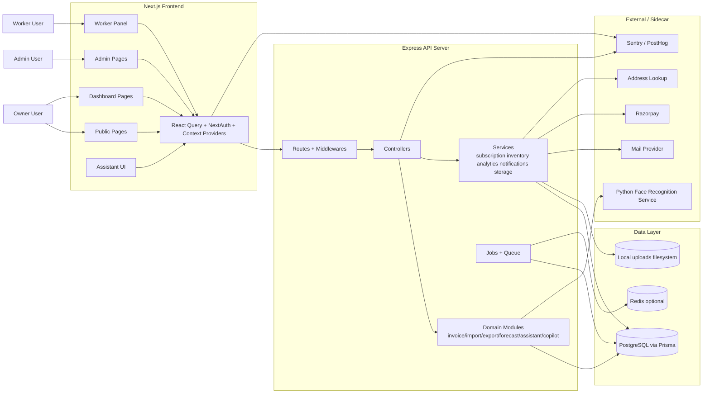
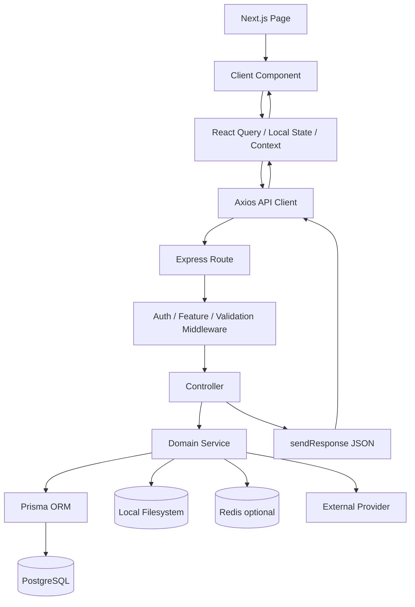
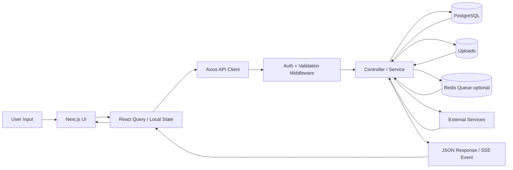
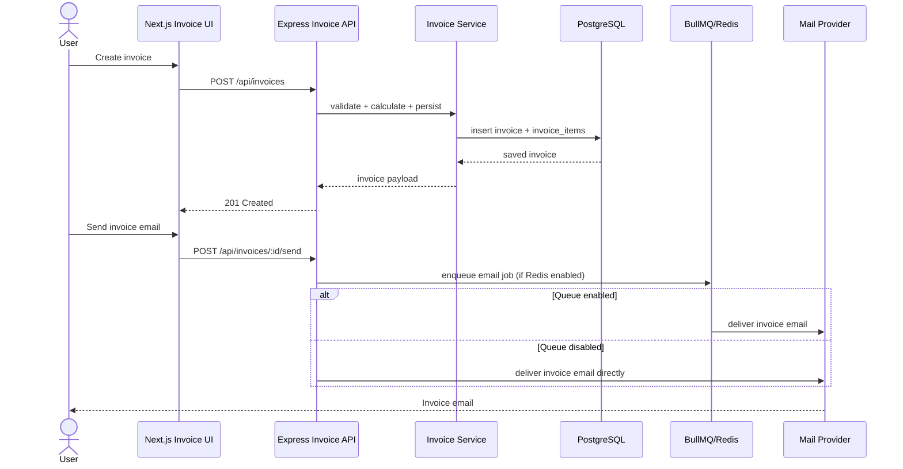
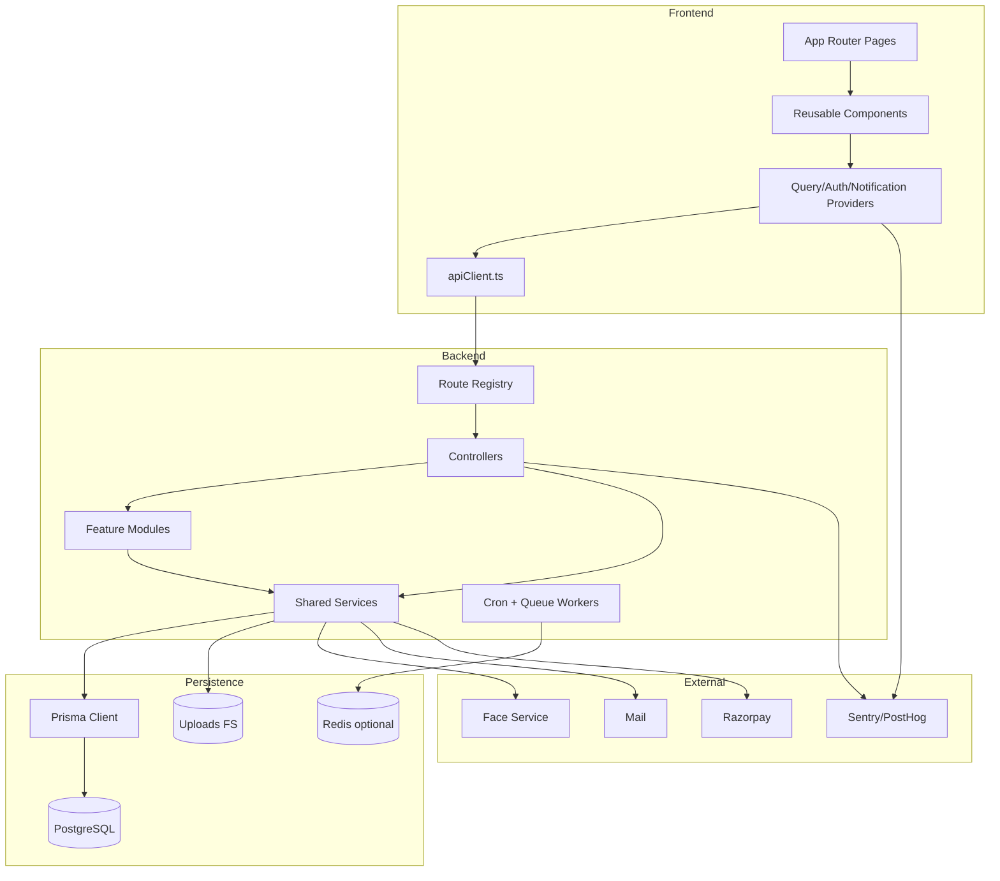
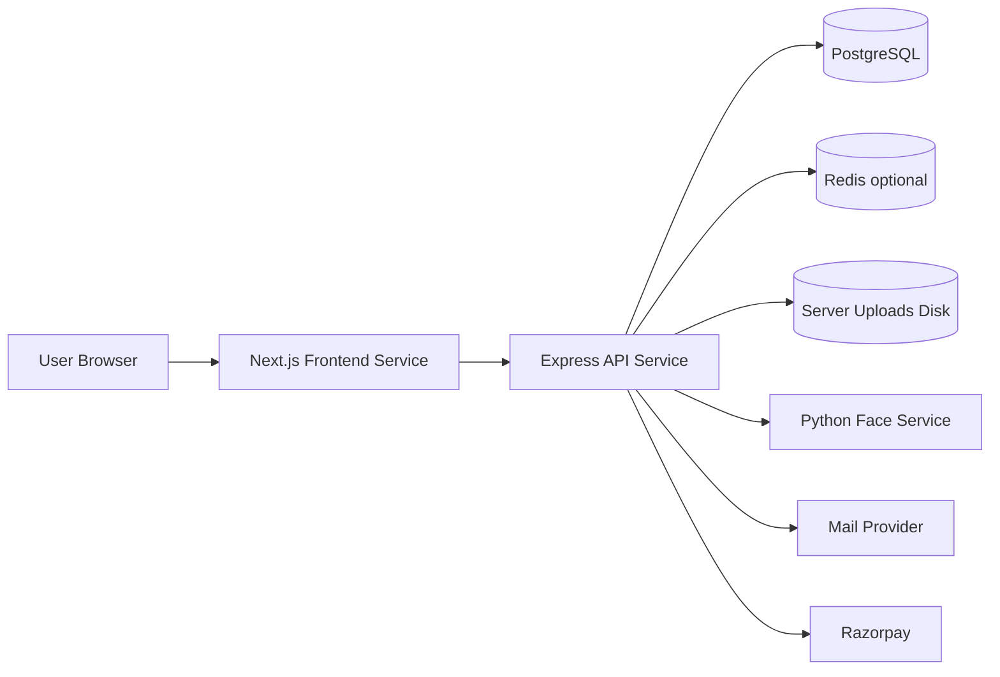

# BillSutra Technical Project Report

Audit date: 2026-04-25

Audit scope reviewed from source:
- Root workspace configuration and documentation
- `front-end/src` (320 source files)
- `server/src` (173 source files)
- `server/prisma` (39 schema/migration files)
- `face_recognition_service` (7 files)
- `shared` (1 shared TypeScript module)

This report is derived from actual code paths, Prisma models, route declarations, client pages, providers, and service modules present in the repository. Where behavior spans multiple files, the flow below is inferred from those concrete code paths rather than from README claims alone.

## 1. Project Overview

### Project name
- BillSutra

### Purpose of the application
- BillSutra is an SMB business operations platform that combines billing, invoicing, payments, sales, purchasing, inventory, supplier/customer management, reporting, and AI-assisted financial guidance in one system.

### Target users
- Small and medium businesses
- Shop owners and billing operators
- Teams with owners plus workers/sales staff
- Admin/support staff reviewing access payments and platform health

### Core problem it solves
- Centralizes fragmented back-office workflows that usually live across spreadsheets, billing tools, payment follow-up, inventory notes, and separate procurement tracking.
- Adds operational visibility with dashboards, reports, forecasting, notifications, and assistant/copilot features.
- Supports both fast billing (`Simple Bill`) and more structured invoice, purchase, and sales workflows.

### Tech stack

| Layer | Observed stack |
| --- | --- |
| Frontend | Next.js 16 App Router, React 19, TypeScript, Tailwind CSS 4, TanStack Query, NextAuth, Radix UI, Sonner, Chart.js/Recharts |
| Backend | Express 5, TypeScript, Prisma ORM, Zod validation, JWT auth, BullMQ, node-cron, Multer, Puppeteer |
| Database | PostgreSQL via Prisma |
| Background / async | BullMQ invoice email queue, cron jobs for recurring invoices and inventory insight warming |
| AI / intelligence | Rule-based assistant service, financial copilot engines, sales forecast module, inventory-demand prediction module |
| External services | Google OAuth, Razorpay, SMTP/Resend-style mail delivery, Redis (optional queue), Sentry, PostHog, address lookup, Python face-recognition sidecar |
| Storage | Local filesystem uploads exposed from `server/uploads` |
| Deployment shape inferred from code | Monorepo with separate Next.js frontend, Express API server, PostgreSQL, optional Redis, and optional Python Flask sidecar for face recognition |

### Repository shape
- `front-end`: user and admin web UI
- `server`: API, business logic, Prisma, jobs, integrations
- `face_recognition_service`: Flask-based face encoding / matching service
- `shared`: shared invoice calculation utility

## 2. Feature Analysis

## 2.1 Marketing site and onboarding surfaces

### Feature: Public landing, pricing, onboarding previews
- Description: Public-facing marketing pages and preview/demo UI for acquisition and onboarding.
- Key code:
  - `front-end/src/app/page.tsx`
  - `front-end/src/app/pricing/page.tsx`
  - `front-end/src/components/hero.tsx`
  - `front-end/src/components/features.tsx`
  - `front-end/src/components/onboarding/*`
- How it works:
  1. Next.js serves public routes without dashboard auth.
  2. Shared branding and CTA components render feature messaging and pricing.
  3. Public pages link into login/register and payment-access flows.
- APIs involved:
  - Mostly static pages.
  - Pricing and payment access pages later call subscription/access endpoints.
- Database interaction:
  - None for static pages.
- Edge cases handled:
  - Not-found and global-error pages exist.
- Missing validations / notes:
  - Documentation and actual route protection docs have drifted in places.

## 2.2 Owner authentication and session bootstrap

### Feature: Credentials login, registration, Google OAuth, account bootstrap
- Description: Primary user authentication for business owners using credentials and Google OAuth.
- Key code:
  - `server/src/controllers/AuthController.ts`
  - `server/src/lib/authSession.ts`
  - `server/src/lib/modernAuth.ts`
  - `server/src/routes/index.ts`
  - `front-end/src/app/api/auth/[...nextauth]/options.ts`
  - `front-end/src/app/api/auth/authRouteHandler.ts`
  - `front-end/src/providers/AuthTokenSync.tsx`
- How it works:
  1. Frontend login/register UI submits to server auth endpoints or NextAuth Google flow.
  2. Backend validates identity, creates or updates user/business bootstrap data, and records auth events.
  3. Session/JWT payload is generated in `authSession.ts`.
  4. Frontend synchronizes bearer token into browser state for API client use.
  5. Protected dashboard pages use the synced token for API access.
- APIs involved:
  - `/api/auth/register`
  - `/api/auth/login`
  - `/api/auth/google`
  - `/api/users/me`
- Database interaction:
  - `users`
  - `businesses`
  - `subscriptions`
  - `subscription_usage`
  - `auth_events`
  - `user_preferences`
  - `business_profiles`
- Edge cases handled:
  - Duplicate email checks
  - Provider-aware user setup
  - Session versioning
  - Business bootstrap when missing
- Missing validations / notes:
  - JWT lifetime is unusually long.
  - Tokens are mirrored into browser-readable storage.

## 2.3 Password reset and OTP login

### Feature: Forgot password, reset password, email OTP login
- Description: Alternative account recovery and login flows beyond static password auth.
- Key code:
  - `server/src/controllers/AuthController.ts`
  - `server/src/validations/apiValidations.ts`
  - `server/src/templates/mail/otpTemplate.ts`
  - `server/src/emails/templates/password-reset.ts`
  - `front-end/src/app/(auth)/forgot-password/page.tsx`
  - `front-end/src/app/(auth)/reset-password/page.tsx`
- How it works:
  1. User requests password reset or OTP login.
  2. Backend issues password reset token or hashed OTP code with expiry and resend timing.
  3. Email template is sent to the user.
  4. User submits reset token or OTP for verification.
  5. Backend marks token/code as used and finalizes login or password change.
- APIs involved:
  - `/api/auth/forgot-password`
  - `/api/auth/reset-password`
  - `/api/auth/otp/request`
  - `/api/auth/otp/verify`
- Database interaction:
  - `password_reset_tokens`
  - `otp_codes`
  - `auth_events`
  - `users`
- Edge cases handled:
  - Expiry windows
  - Max OTP attempts
  - Resend cooldowns
  - Used-token protection
- Missing validations / notes:
  - Rate-limit strategy is not strongly visible in controller logic and should be treated as a security follow-up area.

## 2.4 Passkeys (WebAuthn)

### Feature: Passkey registration, authentication, and device management
- Description: WebAuthn/passkey support for passwordless login and credential lifecycle management.
- Key code:
  - `server/src/controllers/AuthController.ts`
  - `server/src/lib/modernAuth.ts`
  - `front-end/src/lib/apiClient.ts`
  - `@simplewebauthn/browser` usage from frontend
- How it works:
  1. Frontend requests passkey registration/authentication challenge.
  2. Backend stores challenge state in `auth_challenges`.
  3. Browser WebAuthn APIs collect attestation/assertion.
  4. Backend verifies the credential via `@simplewebauthn/server`.
  5. Credential metadata is stored and can later be listed or deleted.
- APIs involved:
  - `/api/auth/passkeys`
  - `/api/auth/passkeys/register/options`
  - `/api/auth/passkeys/register/verify`
  - `/api/auth/passkeys/authenticate/options`
  - `/api/auth/passkeys/authenticate/verify`
- Database interaction:
  - `passkey_credentials`
  - `auth_challenges`
  - `auth_events`
  - `users`
- Edge cases handled:
  - Challenge expiry/consumption
  - Credential counters
  - Multi-device vs single-device metadata
- Missing validations / notes:
  - Operational fallback and recovery UX depends on password/OTP flows remaining healthy.

## 2.5 Worker authentication and worker self-service

### Feature: Worker login plus worker-panel dashboards
- Description: Separate authentication and self-service experience for staff/workers attached to a business.
- Key code:
  - `server/src/controllers/AuthController.ts`
  - `server/src/controllers/WorkerPanelController.ts`
  - `server/src/controllers/WorkersController.ts`
  - `server/src/lib/workerPermissions.ts`
  - `front-end/src/app/(auth)/worker/login/page.tsx`
  - `front-end/src/app/worker-panel/*`
- How it works:
  1. Worker logs in with worker credentials.
  2. Backend resolves business membership and worker role.
  3. Worker token is issued with worker identity.
  4. Worker panel fetches profile, dashboard overview, incentive summary, and work history.
  5. Role checks gate allowed billing/sales endpoints.
- APIs involved:
  - `/api/auth/worker/login`
  - `/api/worker-panel/profile`
  - `/api/worker-panel/change-password`
  - `/api/worker-panel/dashboard`
  - `/api/worker-panel/incentives`
  - `/api/worker-panel/work-history`
- Database interaction:
  - `workers`
  - `businesses`
  - `sales`
  - `invoices`
  - runtime-created `worker_profiles` table (outside Prisma schema)
- Edge cases handled:
  - Worker inactive status
  - Incentive type calculation
  - Period-based performance filters
- Missing validations / notes:
  - Worker authorization relies partly on hardcoded route-prefix matching.
  - Worker profile storage is managed outside Prisma migrations.

## 2.6 Face recognition authentication

### Feature: Face enrollment and face login
- Description: Optional biometric login using a separate Python service for face encoding and matching.
- Key code:
  - `server/src/controllers/FaceRecognitionController.ts`
  - `server/src/routes/faceRecognition.ts`
  - `face_recognition_service/app.py`
  - `front-end/src/components/auth/*` and face-related UI
- How it works:
  1. User uploads or captures a face image.
  2. Express route forwards image processing to the Python sidecar.
  3. Sidecar generates encoding or similarity match data.
  4. Backend stores face data against the user and can authenticate later against stored data.
  5. Frontend presents enrollment and biometric login UI when enabled.
- APIs involved:
  - `/api/face`
  - `/api/face/authenticate`
  - `/api/face/status`
  - `/api/face/delete`
- Database interaction:
  - `face_data`
  - `users`
  - `auth_events`
- Edge cases handled:
  - Enable/disable flags
  - Missing enrollment
  - Delete face data flow
- Missing validations / notes:
  - Actual stored encoding is plain serialized data, not encrypted as docs suggest.
  - Python service CORS is permissive.

## 2.7 Admin console

### Feature: Platform admin login, business inspection, worker listing, payment review
- Description: Separate admin area for platform operators.
- Key code:
  - `server/src/controllers/AdminController.ts`
  - `server/src/controllers/AccessPaymentsController.ts`
  - `front-end/src/app/admin/*`
  - `front-end/src/components/admin/*`
- How it works:
  1. Admin logs in using dedicated admin credentials.
  2. Admin dashboard fetches summary counts and business lists.
  3. Admin can inspect businesses, owners, workers, and platform payment requests.
  4. Admin can approve or reject access payments.
- APIs involved:
  - `/api/admin/login`
  - `/api/admin/summary`
  - `/api/admin/businesses`
  - `/api/admin/businesses/:id`
  - `/api/admin/workers`
  - `/api/admin/access-payments/*`
- Database interaction:
  - `admins`
  - `businesses`
  - `workers`
  - `users`
  - `business_profiles`
  - `access_payments`
- Edge cases handled:
  - Invalid credentials
  - Missing business lookup
- Missing validations / notes:
  - Admin token is also stored in browser-readable storage/cookie.
  - `Business.ownerId` is stored as a string and repeatedly parsed back to integer user IDs.

## 2.8 Subscription gating and access payments

### Feature: Plans, feature access, plan usage, online/manual access payments
- Description: Commercial access control for free/pro/pro-plus style plans.
- Key code:
  - `server/src/controllers/SubscriptionController.ts`
  - `server/src/controllers/AccessPaymentsController.ts`
  - `server/src/services/subscription.service.ts`
  - `server/src/services/accessPayments.service.ts`
  - `server/src/config/subscriptionPlans.ts`
  - `server/src/config/accessPlans.ts`
  - `server/src/middlewares/RequireFeatureAccessMiddleware.ts`
  - `front-end/src/app/payments/page.tsx`
- How it works:
  1. User plan metadata is loaded from `subscriptions`.
  2. Protected assistant/copilot features pass through feature-gate middleware.
  3. User can submit UPI proof or Razorpay payment for plan access.
  4. Admin review flow updates status and activates/extends subscription.
  5. Usage counters track plan-limited actions.
- APIs involved:
  - `/api/subscriptions/me`
  - `/api/subscriptions/plans`
  - `/api/subscriptions/checkout`
  - `/api/subscriptions/activate`
  - `/api/access-payments/*`
  - `/api/payments/razorpay/*`
- Database interaction:
  - `subscriptions`
  - `subscription_usage`
  - `access_payments`
  - `users`
- Edge cases handled:
  - Manual proof uploads
  - Webhook-driven provider reconciliation
  - Feature-gate denial
- Missing validations / notes:
  - Payment proof files are stored under publicly served uploads.

## 2.9 Business profile, logo, settings, and security preferences

### Feature: Business identity, branding preferences, user settings, security center
- Description: Owner-facing settings for business data, invoice branding, notification preferences, and account security.
- Key code:
  - `server/src/controllers/BusinessProfileController.ts`
  - `server/src/controllers/LogoController.ts`
  - `server/src/controllers/SettingsController.ts`
  - `front-end/src/app/business-profile/*`
  - `front-end/src/app/settings/*`
- How it works:
  1. Frontend fetches business profile and user preferences on settings/profile pages.
  2. Backend reads or upserts business profile values.
  3. Logo upload routes save files to local storage.
  4. Settings endpoints manage locale, notifications, negative-stock preference, branding, and security audit details.
- APIs involved:
  - `/api/business-profile`
  - `/api/logo`
  - `/api/settings/preferences`
  - `/api/settings/security`
  - `/api/users/password`
  - `/api/user/data`
  - `/api/user/account`
- Database interaction:
  - `business_profiles`
  - `user_preferences`
  - `notifications`
  - `auth_events`
  - `users`
- Edge cases handled:
  - Partial profile updates
  - Delete-data and delete-account confirmation flows
- Missing validations / notes:
  - Uploaded assets inherit the same public upload exposure issue.

## 2.10 Customer management and ledger reporting

### Feature: Customers/clients CRUD, ledger, and ledger PDF export
- Description: CRM module for customers, balances, invoice/sales linkage, and customer ledger reports.
- Key code:
  - `server/src/controllers/CustomersController.ts`
  - `front-end/src/app/customers/*`
  - `server/src/lib/indianAddress.ts`
  - `server/src/lib/gstin.ts`
- How it works:
  1. Customer list page loads paginated, searchable customer data.
  2. Create/update endpoints normalize address and GSTIN fields.
  3. Customer detail and ledger endpoints aggregate invoices and payments.
  4. Ledger PDF generation uses Puppeteer/browser rendering.
- APIs involved:
  - `/api/customers`
  - `/api/customers/:id`
  - `/api/customers/:id/ledger`
  - `/api/customers/:id/ledger/pdf`
  - alias route `/api/clients`
- Database interaction:
  - `customers`
  - `invoices`
  - `payments`
  - `sales`
  - `recurring_invoice_templates`
- Edge cases handled:
  - Legacy/unstructured address fallbacks
  - Customer schema mismatch fallback when newer columns are absent
- Missing validations / notes:
  - Controller uses raw SQL fallbacks to tolerate schema drift instead of enforcing migrations.

## 2.11 Supplier management

### Feature: Supplier CRUD, pending payable aggregation, quick-add in procurement
- Description: Supplier master data and payable context used by purchases.
- Key code:
  - `server/src/controllers/SuppliersController.ts`
  - `front-end/src/app/suppliers/*`
  - `front-end/src/components/purchases/SmartSupplierSelect.tsx`
- How it works:
  1. Supplier pages fetch searchable/paginated suppliers.
  2. Create/update endpoints normalize categories, address, GSTIN/PAN, and opening balance.
  3. Procurement UI uses debounced supplier search and quick-create.
  4. Pending payable amounts are computed from purchases.
- APIs involved:
  - `/api/suppliers`
  - `/api/suppliers/:id`
  - POST quick-add reuse through same create endpoint
- Database interaction:
  - `suppliers`
  - `purchases`
- Edge cases handled:
  - Category normalization and deduplication
  - Schema mismatch fallback for older supplier columns
- Missing validations / notes:
  - Like customers, raw SQL fallbacks are masking migration drift.

## 2.12 Category and product catalog management

### Feature: Categories and product master data
- Description: Product catalog used across inventory, purchases, sales, invoices, and simple bill.
- Key code:
  - `server/src/controllers/CategoriesController.ts`
  - `server/src/controllers/ProductsController.ts`
  - `front-end/src/app/products/*`
  - `front-end/src/lib/apiClient.ts`
- How it works:
  1. Category and product pages load searchable paginated data.
  2. Product creation validates category ownership and uniqueness constraints.
  3. Catalog data is reused across billing, purchasing, forecasting, and inventory modules.
- APIs involved:
  - `/api/categories`
  - `/api/products`
  - `/api/products/:id`
- Database interaction:
  - `categories`
  - `products`
  - downstream references from `purchase_items`, `sale_items`, `invoice_items`, `inventories`, `stock_movements`
- Edge cases handled:
  - Search by name/SKU/barcode
  - Category name matching
- Missing validations / notes:
  - Barcode existence checks in controller are not consistently scoped by `user_id`, even though schema uniqueness is tenant-scoped.

## 2.13 Warehouse, inventory, stock adjustments, and insights

### Feature: Warehouses, per-warehouse stock, inventory adjustments, low-stock insights
- Description: Inventory layer tracking physical stock and warehouse-specific balances.
- Key code:
  - `server/src/controllers/WarehousesController.ts`
  - `server/src/controllers/InventoriesController.ts`
  - `server/src/controllers/InventoryInsightsController.ts`
  - `server/src/services/inventoryValidation.service.ts`
  - `server/src/services/billingInventorySync.service.ts`
  - `front-end/src/app/inventory/*`
- How it works:
  1. Warehouses and inventory records are fetched per user.
  2. Adjustment endpoints mutate stock levels and create movement semantics.
  3. Billing/sales/invoice flows call inventory validation/sync services.
  4. Insights endpoints and cached jobs compute low stock and replenishment signals.
- APIs involved:
  - `/api/warehouses`
  - `/api/inventories`
  - `/api/inventories/adjust`
  - `/api/inventory-insights`
- Database interaction:
  - `warehouses`
  - `inventories`
  - `products`
  - `stock_movements`
  - `purchases` / `sales` / `invoices` indirectly
- Edge cases handled:
  - Negative stock preference
  - Out-of-stock checks before billing sync
  - Per-warehouse stock lookup
- Missing validations / notes:
  - Some inventory behavior is preference-driven and can intentionally allow negative stock; operationally this should be audited by business type.

## 2.14 Purchase / procurement management

### Feature: Purchase recording, editing, recent purchases, supplier-linked procurement
- Description: Procurement workflow for recording stock purchases from suppliers into warehouses.
- Key code:
  - `server/src/controllers/PurchasesController.ts`
  - `front-end/src/app/purchases/PurchasesClient.tsx`
  - `front-end/src/app/purchases/PurchaseDraftContext.tsx`
  - `front-end/src/components/purchases/*`
- How it works:
  1. Purchase list fetches recent purchases with paging/search.
  2. Create/edit screens load suppliers, products, and warehouse options.
  3. Added items are merged on duplicate product and totals are recalculated in UI.
  4. Backend persists purchase header plus `purchase_items` rows.
  5. Inventory can later use this data for stock and demand analytics.
- APIs involved:
  - `/api/purchases`
  - `/api/purchases/:id`
  - `GET /api/products`
  - `GET/POST /api/suppliers`
  - `GET /api/warehouses`
- Database interaction:
  - `purchases`
  - `purchase_items`
  - `suppliers`
  - `warehouses`
  - `products`
- Edge cases handled:
  - Duplicate item merge
  - Draft-like state persistence on purchase routes
  - Pending/paid amount fields
- Missing validations / notes:
  - Calculations are spread across frontend state and backend normalization; keeping a single shared purchase calculation utility would reduce drift.

## 2.15 Sales recording / POS-like flow

### Feature: Sales entry and inventory deduction
- Description: Sales module for recording completed sales outside the invoice flow.
- Key code:
  - `server/src/controllers/SalesController.ts`
  - `front-end/src/app/sales/*`
  - `server/src/services/billingInventorySync.service.ts`
- How it works:
  1. Sales page loads products/customers.
  2. User creates a sale with item lines and payment status.
  3. Backend stores sale header and sale items.
  4. Inventory sync deducts stock as needed.
  5. Dashboard analytics and worker performance include these sales.
- APIs involved:
  - `/api/sales`
  - `/api/sales/:id`
- Database interaction:
  - `sales`
  - `sale_items`
  - `customers`
  - `products`
  - `inventories`
- Edge cases handled:
  - Worker permission checks
  - Non-inventory sale items
  - Pending balance tracking
- Missing validations / notes:
  - Financial logic overlaps with invoice logic but exists in a separate controller path.

## 2.16 Invoice lifecycle and collections

### Feature: Draft invoices, send/share, duplicate, reminders, public invoice view, recurring invoices, payment recording
- Description: Full invoice engine with item lines, GST/tax support, payment collection, public invoice rendering, and recurring generation.
- Key code:
  - `server/src/modules/invoice/*`
  - `server/src/controllers/PublicInvoiceController.ts`
  - `server/src/controllers/PaymentsController.ts`
  - `server/src/jobs/recurringInvoice.job.ts`
  - `front-end/src/app/invoices/*`
  - `front-end/src/app/invoice/[invoiceId]/*`
  - `shared/invoice-calculations.ts`
- How it works:
  1. Frontend loads invoice bootstrap data and existing invoice history.
  2. User creates/updates invoice lines, customer, discount, notes, and warehouse selection.
  3. Backend calculates totals, persists invoice plus invoice items, and optionally adjusts stock.
  4. Invoice can be duplicated, emailed, reminded, or exposed via public route.
  5. Payment records update invoice status from sent to partially paid/paid.
  6. Recurring invoice cron creates fresh draft invoices from active templates.
  7. Optional BullMQ worker queues invoice email delivery.
- APIs involved:
  - `/api/invoices`
  - `/api/invoices/bootstrap`
  - `/api/invoices/:id`
  - `/api/invoices/:id/duplicate`
  - `/api/invoices/:id/send`
  - `/api/invoices/:id/remind`
  - `/api/payments`
  - `/api/payments/invoices/:invoiceId`
  - public invoice endpoints via `/api/invoice/:id`, `/api/public/invoice/:id`, `/api/invoices/:id` bypass handling
- Database interaction:
  - `invoices`
  - `invoice_items`
  - `payments`
  - `customers`
  - `products`
  - `recurring_invoice_templates`
  - `stock_movements`
  - `export_logs` indirectly for PDF/email exports
- Edge cases handled:
  - Duplicate invoice number generation
  - Draft/sent/paid/overdue status transitions
  - Public invoice access paths
  - Queued vs direct email delivery fallback
- Missing validations / notes:
  - Payment create + aggregate + invoice update is not wrapped in a transaction.
  - There is legacy `InvoicesController.ts` alongside the new modular invoice implementation, which increases maintenance risk.

## 2.17 Template customization and user-saved templates

### Feature: Invoice templates, template sections, user-specific design settings
- Description: System templates plus user-enabled sections and saved variants for invoice rendering.
- Key code:
  - `server/src/controllers/TemplatesController.ts`
  - `server/src/controllers/UserTemplateController.ts`
  - `server/src/controllers/UserSavedTemplateController.ts`
  - `front-end/src/app/templates/*`
  - `front-end/src/components/invoice/templates/*`
- How it works:
  1. Base templates are fetched from `templates`.
  2. User-level settings choose enabled sections, order, and theme color.
  3. User can save derived template variants.
  4. Invoice preview/PDF components render based on selected template config.
- APIs involved:
  - `/api/templates`
  - `/api/user-template`
  - `/api/user-saved-templates`
- Database interaction:
  - `templates`
  - `template_sections`
  - `user_templates`
  - `user_saved_templates`
- Edge cases handled:
  - Missing saved-template base template uses nullable relation
- Missing validations / notes:
  - Template config is JSON-heavy; schema validation on design config would help long-term maintainability.

## 2.18 Simple Bill quick billing

### Feature: Fast product billing flow
- Description: A simplified billing interface optimized for quickly creating bills from products.
- Key code:
  - `front-end/src/app/simple-bill/SimpleBillClient.tsx`
  - `front-end/src/components/billing/*`
  - `server/src/controllers/ProductsController.ts`
  - invoice-related save endpoints
- How it works:
  1. Frontend loads products/customers/business profile data.
  2. User adds products, edits quantities/prices, and sees live totals.
  3. Flow can create bill/invoice records using shared invoice APIs.
  4. Public/private invoice detail pages can then display the generated invoice.
- APIs involved:
  - Product/customer fetch endpoints
  - Invoice creation endpoints
- Database interaction:
  - `products`
  - `customers`
  - `invoices`
  - `invoice_items`
- Edge cases handled:
  - Product search and duplicate item merging in quick-bill UX
- Missing validations / notes:
  - This flow duplicates some invoice-calculation logic on the frontend and should keep using shared calculations where possible.

## 2.19 Dashboard, analytics, reports, and notifications

### Feature: Operational dashboard, metrics APIs, reports, realtime updates, notifications
- Description: Read-model layer for business visibility and operational alerts.
- Key code:
  - `server/src/controllers/DashboardController.ts`
  - `server/src/controllers/AnalyticsController.ts`
  - `server/src/controllers/ReportsController.ts`
  - `server/src/controllers/NotificationsController.ts`
  - `server/src/services/dashboardAnalyticsService.ts`
  - `server/src/services/dashboardRealtime.ts`
  - `front-end/src/app/dashboard/*`
  - `front-end/src/app/insights/*`
  - `front-end/src/app/notifications/*`
- How it works:
  1. Dashboard pages request summary cards, trends, profit, cashflow, receivables, payables, and forecast datasets.
  2. Backend aggregates invoices, sales, purchases, extra entries, and inventory signals.
  3. Server-sent events stream dashboard refresh triggers.
  4. Notification service writes alert records for payment, worker, subscription, and inventory events.
  5. Reports and analytics pages render higher-level summaries and charts.
- APIs involved:
  - `/api/dashboard/*`
  - `/api/analytics/*`
  - `/api/reports/*`
  - `/api/notifications`
- Database interaction:
  - `notifications`
  - `sales`
  - `purchases`
  - `invoices`
  - `payments`
  - `products`
  - `extra_entries`
  - `subscriptions`
- Edge cases handled:
  - Expenses table existence fallback
  - SSE auth path for dashboard stream
- Missing validations / notes:
  - Some analytics logic uses raw SQL and optional table detection, which is resilient but signals schema inconsistency.

## 2.20 Assistant and financial copilot

### Feature: Billing assistant, natural-language command parsing, financial copilot, goals
- Description: Rule-based assistant plus financial copilot that turns business data into conversational answers and recommendations.
- Key code:
  - `server/src/modules/assistant/*`
  - `server/src/modules/copilot/*`
  - `front-end/src/app/assistant/*`
  - `front-end/src/components/assistant/*`
  - `front-end/src/components/dashboard/DashboardLayout.tsx`
- How it works:
  1. User submits a natural-language prompt.
  2. Assistant parser detects language, intent, period, amount, and navigation target.
  3. Service aggregates finance snapshots, product suggestions, and billing actions.
  4. Copilot engines compute budget, savings, health score, reminders, decision support, goals, and nudges.
  5. Response is rendered in assistant UI and can deep-link users into invoices/products/customers/simple-bill.
- APIs involved:
  - `/api/assistant/*`
  - `/api/copilot/*`
- Database interaction:
  - `sales`
  - `purchases`
  - `invoices`
  - `products`
  - `customers`
  - `financial_goals`
  - `extra_entries`
  - `subscriptions` for feature gating
- Edge cases handled:
  - Language detection for English/Hindi/Hinglish
  - Billing-only fallback behavior
  - Goal CRUD
- Missing validations / notes:
  - Frontend imports assistant contract types directly from server source, coupling builds across packages.

## 2.21 Forecasting and prediction-driven restocks

### Feature: Sales forecast and inventory-demand replenishment suggestions
- Description: Forecasting module for projected revenue and demand-driven restock suggestions.
- Key code:
  - `server/src/modules/forecast/*`
  - `server/src/modules/inventory-demand/*`
  - `front-end/src/hooks/usePredictionQueries.ts`
  - `front-end/src/components/inventory/*`
  - `front-end/src/components/purchases/suggested-purchases-panel.tsx`
- How it works:
  1. Backend aggregates historical sales data over weekly/monthly/yearly windows.
  2. Forecast service applies simple moving-average smoothing.
  3. Inventory-demand service estimates days-left/runout and suggested restock quantities.
  4. Frontend insight panels render alerts and can route into purchase creation with prefilled product/supplier context.
- APIs involved:
  - `/api/forecast/sales`
  - `/api/inventory-demand/summary`
  - `/api/inventory-demand/items`
- Database interaction:
  - `sales`
  - `sale_items`
  - `products`
  - `inventories`
  - `purchase_items` indirectly for supplier suggestions
- Edge cases handled:
  - Zero-history fallback
  - Date normalization and runout formatting
- Missing validations / notes:
  - Forecasting is heuristic rather than ML-driven; suitable for lightweight guidance, not formal demand planning.

## 2.22 Import pipeline

### Feature: CSV/XLSX imports for clients, products, invoices, and invoice items
- Description: Bulk data onboarding/import utilities.
- Key code:
  - `server/src/modules/import/*`
  - `front-end/src/lib/apiClient.ts`
- How it works:
  1. User uploads a file through multipart form routes.
  2. Backend parses CSV/XLSX rows, validates headers and records.
  3. Module creates business records in bulk and returns import results/errors.
  4. Sample template/download endpoints support correct formatting.
- APIs involved:
  - `/api/import/clients`
  - `/api/import/products`
  - `/api/import/invoices`
  - `/api/import/invoice-items`
  - import template/sample endpoints
- Database interaction:
  - `customers`
  - `products`
  - `invoices`
  - `invoice_items`
- Edge cases handled:
  - File upload middleware
  - Sample template endpoints
- Missing validations / notes:
  - Bulk imports are always a good candidate for stricter dry-run reporting and idempotency controls.

## 2.23 Export pipeline

### Feature: CSV/XLSX/PDF/JSON exports with preview, email, and logging
- Description: Data export module for products, customers, invoices, and reports.
- Key code:
  - `server/src/modules/export/export.service.ts`
  - `server/src/controllers/MailController.ts`
  - `server/src/services/storage/*`
- How it works:
  1. User requests export with resource, filters, format, and delivery mode.
  2. Backend builds dataset, renders target format, and optionally emails the result.
  3. Export action is persisted to an audit log.
  4. Files can also be previewed/downloaded directly.
- APIs involved:
  - `/api/export/preview`
  - `/api/export/run`
  - export mail endpoints
- Database interaction:
  - `export_logs`
  - exported business tables vary by resource
- Edge cases handled:
  - Preview before generation
  - Delivery mode switch between download and email
- Missing validations / notes:
  - Local filesystem storage is simple but will need object storage if exports scale up.

## 2.24 Extra entries and financial goals

### Feature: Non-core financial entries and goals tracking
- Description: Supplemental finance data for expenses, losses, investments, income adjustments, and goals.
- Key code:
  - `server/src/controllers/ExtraEntryController.ts`
  - `server/src/modules/copilot/copilot.data.ts`
  - `front-end/src/app/insights/*`
- How it works:
  1. User records extra entries outside sales/purchase/invoice primitives.
  2. Dashboard and copilot aggregate these entries into profit/cashflow and behavioral recommendations.
  3. Goal tracking reads current progress and target pacing.
- APIs involved:
  - `/api/extra-entries`
  - `/api/copilot/goals`
- Database interaction:
  - `extra_entries`
  - `financial_goals`
- Edge cases handled:
  - Entry type distinctions and date filtering
- Missing validations / notes:
  - This module is useful for finance completeness but still depends on users entering supplemental data consistently.

## 3. System Architecture

### Overall architecture
- Primary architecture: modular monolith.
- Frontend and backend are deployed as separate services, but backend business domains live in one Express application rather than as microservices.
- A lightweight Python sidecar provides face-recognition compute.
- Redis is optional and only used for queue-backed invoice email delivery.

### Client -> server -> database flow
1. Next.js frontend renders App Router pages and uses React Query plus an Axios-based API client.
2. Frontend sends authenticated requests to Express `/api/*`.
3. Express routes apply auth middleware, feature-gate middleware, and Zod validation.
4. Controllers/services use Prisma against PostgreSQL.
5. Some workflows also touch local filesystem storage, BullMQ/Redis, cron jobs, or the face-recognition sidecar.
6. Responses are normalized with `sendResponse`, then React Query refreshes UI state.

### External services
- Redis/BullMQ:
  - Optional queue for invoice email delivery.
- Python face service:
  - Handles face encoding and authentication comparisons.
- Mail:
  - SMTP/Resend-like delivery for OTP, password reset, invoice, and export emails.
- Razorpay:
  - Handles subscription/access payment collection and webhook verification.
- Observability:
  - Sentry on frontend/backend.
  - PostHog on frontend.
- Storage:
  - Local filesystem storage provider for uploads and generated assets.

### System architecture diagram

## 4. System Design

### High-level design (HLD)
- Presentation layer:
  - Next.js App Router pages, page-specific clients, shared UI components.
- Client state/data layer:
  - TanStack Query for remote data caching.
  - NextAuth for auth session integration.
  - Feature-specific context such as `PurchaseDraftContext`.
  - Local component state for billing, invoice editing, filters, and dialogs.
- API layer:
  - Express route registry in `server/src/routes/index.ts`.
  - Domain routers under `server/src/modules/*`.
- Domain layer:
  - Controllers orchestrate request/response.
  - Services hold reusable domain logic for analytics, inventory, subscriptions, mail, storage, notifications.
- Persistence layer:
  - Prisma models in PostgreSQL.
  - Local upload filesystem.
  - Optional Redis queue.
- Async layer:
  - BullMQ for invoice email jobs.
  - node-cron for recurring invoices and cache warming.

### Low-level design (LLD)
- Route pattern:
  - Route -> auth/validation middleware -> controller -> service/prisma -> normalized response.
- Validation pattern:
  - Zod schemas in `server/src/validations/apiValidations.ts`.
- Query pattern:
  - Prisma ORM for standard CRUD.
  - `prisma.$queryRaw` and `prisma.$executeRaw` used in a few controllers to bridge schema drift or custom aggregations.
- Frontend API pattern:
  - `front-end/src/lib/apiClient.ts` contains a centralized Axios client plus typed helper methods.
- Reuse pattern:
  - Shared financial helpers exist, but some totals logic is still duplicated across modules.

### Example request lifecycle: login
1. User submits login form.
2. Frontend calls auth endpoint or NextAuth provider handler.
3. `AuthController` validates credentials / OAuth identity.
4. `authSession.ts` creates normalized auth payload and JWT.
5. Frontend stores/syncs token and fetches `/users/me`.
6. App renders dashboard with authenticated API calls.

### Example request lifecycle: create invoice
1. Invoice UI loads bootstrap data for customers, products, warehouses, templates.
2. User edits invoice lines and totals on the client.
3. Frontend submits create/update payload to invoice module route.
4. Invoice service validates customer/items, calculates totals, persists invoice and `invoice_items`.
5. Optional inventory sync updates stock and stock movements.
6. Dashboard SSE and cache invalidations refresh dependent screens.
7. User can later send, duplicate, or record payment for the invoice.

### Example request lifecycle: record purchase
1. Purchase UI loads suppliers, products, warehouses, and recent purchases.
2. User selects supplier and adds products.
3. Client merges duplicate lines and recalculates totals in real time.
4. Backend validates supplier/products and writes purchase header plus item rows.
5. Procurement data becomes available to inventory-demand and reporting modules.

### Frontend state management
- Global-ish state mechanisms actually used:
  - React Query cache for server state
  - NextAuth session context
  - Notification provider
  - Auth token sync provider
- Feature-local state mechanisms:
  - `PurchaseDraftContext` for procurement flow continuity
  - local `useState`/`useReducer` in invoice, dashboard, simple-bill, assistant, inventory pages
- Observed pattern:
  - The project does not use a single Redux/Zustand store across the whole product.
  - State is hybrid: remote data in Query cache, auth in NextAuth/token sync, complex forms in local feature state/context.

### API design patterns used
- REST-like JSON endpoints with resource-oriented naming
- Central route registry plus feature subrouters
- `sendResponse()` wrapper for consistent API envelope
- Zod validation for many create/update operations
- Prisma-backed pagination and search
- SSE for dashboard refresh streaming
- Multipart upload routes for imports, logos, payment proofs, and face images

### System design diagram

## 5. Database Design

### Entity inventory by domain

| Domain | Entities |
| --- | --- |
| Identity and access | `User`, `Admin`, `Business`, `Worker`, `PasskeyCredential`, `AuthChallenge`, `OtpCode`, `PasswordResetToken`, `AuthEvent`, `FaceData` |
| Preferences and customization | `UserPreference`, `BusinessProfile`, `Template`, `TemplateSection`, `UserTemplate`, `UserSavedTemplate` |
| Core master data | `Customer`, `Supplier`, `Category`, `Product`, `Warehouse`, `Inventory` |
| Transactions | `Purchase`, `PurchaseItem`, `Sale`, `SaleItem`, `Invoice`, `InvoiceItem`, `Payment`, `RecurringInvoiceTemplate`, `StockMovement` |
| Platform billing | `AccessPayment`, `Subscription`, `SubscriptionUsage` |
| Finance and observability | `FinancialGoal`, `ExtraEntry`, `Notification`, `ExportLog` |

### Relationship highlights
- One `User` owns most business data rows.
- `Customer`, `Supplier`, `Category`, `Product`, `Warehouse`, `Purchase`, `Sale`, `Invoice`, `Payment`, `ExtraEntry`, and many support tables are tenant-scoped by `user_id`.
- `Product` is the shared master referenced by purchase items, sale items, invoice items, inventory, and stock movements.
- `Warehouse` and `Product` meet through `Inventory`.
- `Invoice` links to `Customer` and contains `InvoiceItem` and `Payment` children.
- `Purchase` links to optional `Supplier` and `Warehouse`, then contains `PurchaseItem` children.
- `Sale` links to optional `Customer` and contains `SaleItem` children.
- `RecurringInvoiceTemplate` belongs to a `User` and `Customer`.
- `Subscription` is effectively one-to-one with `User`.
- `Business.ownerId` is only a logical owner reference stored as string, not a Prisma relation to `User`.

### ER diagram

```mermaid
erDiagram
  USER {
    int id PK
    string email
    string name
    string provider
    bool is_email_verified
    int session_version
  }
  USER_PREFERENCE {
    int id PK
    int user_id UK
    string language
    string currency
    bool allow_negative_stock
  }
  NOTIFICATION {
    string id PK
    int user_id FK
    string business_id
    string type
    bool is_read
  }
  ADMIN {
    string id PK
    string email UK
    string role
  }
  BUSINESS {
    string id PK
    string name
    string owner_id
  }
  WORKER {
    string id PK
    string business_id FK
    string email UK
    string role
  }
  BUSINESS_PROFILE {
    int id PK
    int user_id UK
    string business_name
    string phone
    string email
    string currency
  }
  TEMPLATE {
    int id PK
    string name UK
  }
  TEMPLATE_SECTION {
    int id PK
    int template_id FK
    string section_key
    int section_order
  }
  USER_TEMPLATE {
    int id PK
    int user_id FK
    int template_id FK
  }
  USER_SAVED_TEMPLATE {
    int id PK
    int user_id FK
    int base_template_id FK
    string name
  }
  FINANCIAL_GOAL {
    int id PK
    int user_id FK
    string title
    decimal target_amount
    decimal current_amount
  }
  EXTRA_ENTRY {
    string id PK
    int user_id FK
    string title
    decimal amount
    string type
    date date
  }
  CUSTOMER {
    int id PK
    int user_id FK
    string name
    string email
    string phone
  }
  SUPPLIER {
    int id PK
    int user_id FK
    string name
    string gstin
    string phone
  }
  CATEGORY {
    int id PK
    int user_id FK
    string name
  }
  PRODUCT {
    int id PK
    int user_id FK
    int category_id FK
    string name
    string sku
    string barcode
    decimal price
    decimal cost
    int stock_on_hand
  }
  WAREHOUSE {
    int id PK
    int user_id FK
    string name
    string location
  }
  INVENTORY {
    int id PK
    int warehouse_id FK
    int product_id FK
    int quantity
  }
  PURCHASE {
    int id PK
    int user_id FK
    int supplier_id FK
    int warehouse_id FK
    decimal subtotal
    decimal total
    string payment_status
  }
  PURCHASE_ITEM {
    int id PK
    int purchase_id FK
    int product_id FK
    string name
    int quantity
    decimal unit_cost
    decimal line_total
  }
  SALE {
    int id PK
    int user_id FK
    int customer_id FK
    string status
    decimal subtotal
    decimal total
    string payment_status
  }
  SALE_ITEM {
    int id PK
    int sale_id FK
    int product_id FK
    string name
    int quantity
    decimal unit_price
    decimal line_total
  }
  INVOICE {
    int id PK
    int user_id FK
    int customer_id FK
    string invoice_number
    string status
    int warehouse_id
    decimal subtotal
    decimal tax
    decimal discount
    decimal total
  }
  RECURRING_INVOICE_TEMPLATE {
    int id PK
    int user_id FK
    int customer_id FK
    string title
    string frequency
    date next_run_date
  }
  INVOICE_ITEM {
    int id PK
    int invoice_id FK
    int product_id FK
    string name
    int quantity
    decimal unit_price
    decimal line_total
  }
  PAYMENT {
    int id PK
    int user_id FK
    int invoice_id FK
    decimal amount
    string method
    date paid_at
  }
  ACCESS_PAYMENT {
    string id PK
    int user_id FK
    string plan_id
    string method
    decimal amount
    string status
  }
  SUBSCRIPTION {
    string id PK
    int user_id UK
    string plan_id
    string status
    string billing_cycle
  }
  SUBSCRIPTION_USAGE {
    int id PK
    string subscription_id FK
    int user_id FK
    string period_key
  }
  STOCK_MOVEMENT {
    int id PK
    int product_id FK
    int change
    string reason
  }
  PASSWORD_RESET_TOKEN {
    int id PK
    int user_id FK
    string token UK
    date expires_at
  }
  EXPORT_LOG {
    int id PK
    int user_id FK
    string actor_id
    string resource
    string format
  }
  PASSKEY_CREDENTIAL {
    int id PK
    int user_id FK
    string credential_id UK
    string label
    int counter
  }
  AUTH_CHALLENGE {
    int id PK
    int user_id FK
    string flow
    string challenge UK
    date expires_at
  }
  OTP_CODE {
    int id PK
    int user_id FK
    string purpose
    string channel
    string code_hash
    int attempts
  }
  AUTH_EVENT {
    int id PK
    int user_id FK
    string actor_type
    string method
    bool success
  }
  FACE_DATA {
    int id PK
    int user_id UK
    string face_encoding
    bool is_enabled
  }

  USER ||--|| USER_PREFERENCE : has
  USER ||--o| BUSINESS_PROFILE : has
  USER ||--o{ NOTIFICATION : receives
  BUSINESS ||--o{ WORKER : contains
  USER ||--o{ CUSTOMER : owns
  USER ||--o{ SUPPLIER : owns
  USER ||--o{ CATEGORY : owns
  USER ||--o{ PRODUCT : owns
  USER ||--o{ WAREHOUSE : owns
  USER ||--o{ PURCHASE : owns
  USER ||--o{ SALE : owns
  USER ||--o{ INVOICE : owns
  USER ||--o{ PAYMENT : records
  USER ||--o{ ACCESS_PAYMENT : submits
  USER ||--o| SUBSCRIPTION : has
  USER ||--o{ SUBSCRIPTION_USAGE : accumulates
  USER ||--o{ PASSWORD_RESET_TOKEN : has
  USER ||--o{ PASSKEY_CREDENTIAL : has
  USER ||--o{ AUTH_CHALLENGE : has
  USER ||--o{ OTP_CODE : has
  USER ||--o{ AUTH_EVENT : emits
  USER ||--o| FACE_DATA : has
  USER ||--o{ EXPORT_LOG : creates
  USER ||--o{ USER_TEMPLATE : configures
  USER ||--o{ USER_SAVED_TEMPLATE : saves
  USER ||--o{ FINANCIAL_GOAL : tracks
  USER ||--o{ EXTRA_ENTRY : records

  TEMPLATE ||--o{ TEMPLATE_SECTION : contains
  TEMPLATE ||--o{ USER_TEMPLATE : base_for
  TEMPLATE ||--o{ USER_SAVED_TEMPLATE : base_for

  CATEGORY ||--o{ PRODUCT : groups
  PRODUCT ||--o{ INVENTORY : stocked_as
  WAREHOUSE ||--o{ INVENTORY : holds

  SUPPLIER ||--o{ PURCHASE : supplies
  WAREHOUSE ||--o{ PURCHASE : receives_into
  PURCHASE ||--o{ PURCHASE_ITEM : contains
  PRODUCT ||--o{ PURCHASE_ITEM : purchased_as

  CUSTOMER ||--o{ SALE : buys_in
  SALE ||--o{ SALE_ITEM : contains
  PRODUCT ||--o{ SALE_ITEM : sold_as

  CUSTOMER ||--o{ INVOICE : billed_in
  INVOICE ||--o{ INVOICE_ITEM : contains
  PRODUCT ||--o{ INVOICE_ITEM : invoiced_as
  INVOICE ||--o{ PAYMENT : paid_by

  CUSTOMER ||--o{ RECURRING_INVOICE_TEMPLATE : scheduled_for
  USER ||--o{ RECURRING_INVOICE_TEMPLATE : owns

  SUBSCRIPTION ||--o{ SUBSCRIPTION_USAGE : measures
  PRODUCT ||--o{ STOCK_MOVEMENT : logs
```

## 6. Data Flow Diagram (DFD)

### Narrative
1. User enters data in a Next.js page or modal.
2. Client state validates basic form rules and calls centralized API helpers.
3. Express authenticates the request and validates payload shape.
4. Controller/service orchestrates domain logic.
5. Prisma reads/writes PostgreSQL.
6. Optional side effects update local uploads, Redis queue, notifications, SSE, or external providers.
7. Normalized JSON response returns to the frontend and refreshes the UI.

### DFD

## 7. Module Breakdown

| Module | Responsibility | Key files | Main interactions |
| --- | --- | --- | --- |
| Auth | Owner login/register, OAuth, OTP, passkeys, password reset | `server/src/controllers/AuthController.ts`, `server/src/lib/authSession.ts`, `front-end/src/app/api/auth/*` | Users, auth events, business bootstrap, email templates |
| Worker | Worker management and self-service | `WorkersController.ts`, `WorkerPanelController.ts`, `front-end/src/app/workers/*`, `front-end/src/app/worker-panel/*` | Businesses, sales, invoices, auth |
| Admin | Platform oversight | `AdminController.ts`, `front-end/src/app/admin/*` | Businesses, workers, access payments, owners |
| Subscription | Plan access and feature gating | `SubscriptionController.ts`, `accessPayments.service.ts`, `RequireFeatureAccessMiddleware.ts` | Users, subscriptions, access payments, Razorpay |
| CRM | Customers and suppliers | `CustomersController.ts`, `SuppliersController.ts`, corresponding frontend apps | Invoices, purchases, ledgers |
| Catalog | Categories and products | `CategoriesController.ts`, `ProductsController.ts`, `front-end/src/app/products/*` | Inventory, purchases, sales, invoices |
| Inventory | Warehouses, stocks, adjustments, insights | `InventoriesController.ts`, `WarehousesController.ts`, `inventoryValidation.service.ts` | Products, purchases, sales, invoices, forecasting |
| Procurement | Purchase creation/edit/history | `PurchasesController.ts`, `front-end/src/app/purchases/*` | Suppliers, products, warehouses, inventory-demand |
| Sales | Direct sales recording | `SalesController.ts`, `front-end/src/app/sales/*` | Customers, products, worker performance, inventory |
| Billing | Invoices, payments, public invoice, recurring, simple bill | `server/src/modules/invoice/*`, `PaymentsController.ts`, `PublicInvoiceController.ts`, `front-end/src/app/invoices/*`, `front-end/src/app/simple-bill/*` | Customers, products, templates, payments, exports |
| Templates | Invoice rendering configuration | `TemplatesController.ts`, `UserTemplateController.ts`, `UserSavedTemplateController.ts` | Invoice UI and PDF rendering |
| Reporting | Dashboard, analytics, reports, notifications | `DashboardController.ts`, `AnalyticsController.ts`, `ReportsController.ts`, `NotificationsController.ts` | All transactional tables |
| AI & prediction | Assistant, copilot, forecast, inventory-demand | `server/src/modules/assistant/*`, `copilot/*`, `forecast/*`, `inventory-demand/*` | Sales, purchases, invoices, products, goals |
| Data portability | Import/export | `server/src/modules/import/*`, `server/src/modules/export/*` | Customers, products, invoices, logs, email |
| Observability & infra | Mail, storage, observability, realtime | `mailService.ts`, `storage.provider.ts`, `dashboardRealtime.ts`, observability libs | External services and side effects |
| Biometric sidecar | Face recognition processing | `face_recognition_service/app.py`, `FaceRecognitionController.ts` | Uploaded images, face encodings, auth |

## 8. Code Quality and Issue Analysis

### Overall assessment
- The project is feature-rich and has the shape of a serious SMB operations suite.
- The dominant architectural strength is breadth: most business workflows are represented end-to-end in both UI and API.
- The dominant architectural weakness is consistency: some modules are cleanly Prisma-first and modular, while others still contain legacy/raw-SQL drift workarounds, duplicate implementations, or security shortcuts.

### Main issue themes observed
- Security:
  - Long-lived bearer tokens
  - Browser-readable token storage
  - Publicly served uploads for sensitive files
  - Biometric encoding storage concerns
- Data consistency:
  - Runtime schema-drift compensations in controllers
  - Runtime DDL creation for worker profile support
  - Non-transactional multi-step writes
- Architecture:
  - Direct frontend import from backend source tree
  - Legacy controller/config artifacts still present
  - Mixed domain boundaries between old controllers and new module routers
- Performance / maintainability:
  - Heavier controllers with raw SQL and broad responsibility
  - Repeated financial calculation logic across modules
  - Optional-table detection and compatibility code in read models

### Separate issue register
- See `ISSUES_REPORT.md` for severity-ranked findings with root cause and suggested remediation.

## 9. Improvement Suggestions

### Architecture improvements
- Standardize on one backend style:
  - Prefer modular route/controller/service organization like the invoice module across the rest of the codebase.
- Remove schema-drift fallbacks:
  - Replace runtime raw-SQL compatibility logic with enforced Prisma migrations and startup checks.
- Introduce clear domain boundaries:
  - Billing, sales, procurement, inventory, and CRM should share calculation utilities but not duplicate them.
- Convert logical relationships into actual foreign keys where possible:
  - `Business.ownerId` should become a proper FK to `User.id`.

### Performance optimizations
- Move more heavy aggregations into dedicated read services or materialized/cache layers.
- Keep using debounce in search-heavy forms and extend lazy/paginated fetching patterns consistently.
- Consider background generation for large exports and PDFs rather than inline request work.
- Warm/cache expensive dashboard and inventory insight queries predictably.

### Security enhancements
- Shorten access-token lifetime and introduce refresh-token or rotating session architecture.
- Stop storing bearer tokens in `localStorage` and JS-readable cookies.
- Move sensitive uploads to private storage with signed access.
- Encrypt biometric templates at rest and tighten face-service CORS.
- Add stronger rate-limiting and abuse monitoring around auth, OTP, and face endpoints.

### Scalability suggestions
- Migrate local uploads to object storage.
- Use Redis more intentionally for cache and queue patterns if traffic increases.
- Separate analytics/reporting read models from transactional write paths if dashboard load grows.
- Make export/import operations more async/job-oriented.

### Code refactoring suggestions
- Extract shared monetary calculation libraries for purchase, sale, invoice, and simple-bill flows.
- Replace ad hoc raw SQL with Prisma or repository-level abstractions where possible.
- Delete or archive dead/legacy code paths (`mongoose.ts`, old invoice controller if unused).
- Keep frontend contracts in a shared package instead of importing from `server/src`.

## 10. Additional Diagrams

### Sequence diagram: invoice creation and delivery

### Component diagram

### Deployment diagram

## Closing summary

BillSutra is a broad modular-monolith business platform with strong coverage across billing, inventory, procurement, CRM, payments, and analytics. The codebase already contains most of the building blocks a production SMB platform needs. The main engineering priority is not feature breadth but operational hardening: unify domain patterns, eliminate schema-drift workarounds, tighten token/upload/biometric security, and reduce coupling between frontend and backend internals.
