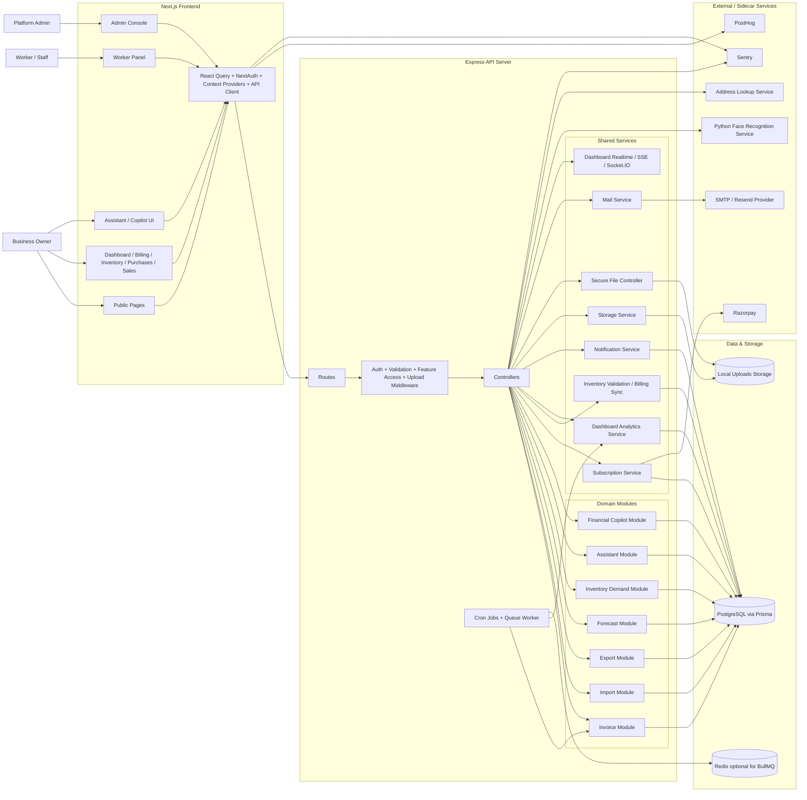

# BillSutra System Architecture Diagram

## Notes

- Frontend: Next.js App Router application serving public, owner, worker, and admin experiences; production builds run from the generated standalone server.
- Backend: single Express-based modular monolith with feature-specific controllers, modules, and services.
- Database: PostgreSQL is the source of truth through Prisma.
- Async processing: BullMQ workers are used when TCP Redis queues are enabled; cron jobs handle recurring invoices and cache warming.
- Storage: public assets are served from `/uploads/public`; private uploads/exports are served through authenticated or signed controller paths.
- Sidecar: face recognition runs as a separate Python service invoked by the backend.
